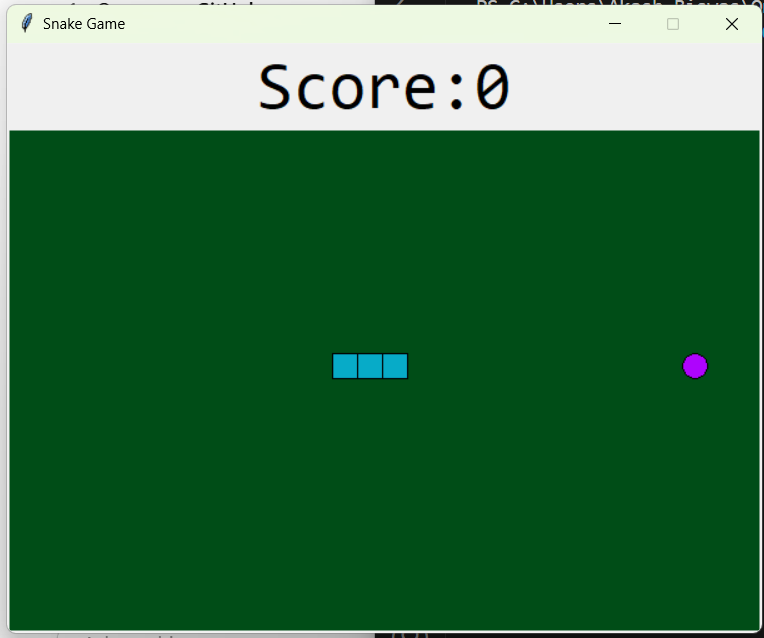

# 🐍 Python Snake Game

A simple and classic **Snake Game** built with **Python** and **Tkinter** GUI library.

## 🎮 Game Overview

This is a grid-based **Snake Game** where:

- The **snake moves continuously** in the selected direction.
- You can **change direction** using the **arrow keys**.
- The snake **grows when it eats the food**.
- The game **ends when the snake hits the wall or itself**.

## 🚀 Features

- **Smooth gameplay** using `Tkinter Canvas`
- **Score tracking** displayed at the top
- **Game over message** when the game ends
- **Random food generation**
- Simple and minimal design

## 🖥️ GUI Screenshot

## 🧰 Requirements

- **Python 3.x**  
- No external libraries required (only `tkinter` and `random` which are standard in Python)

